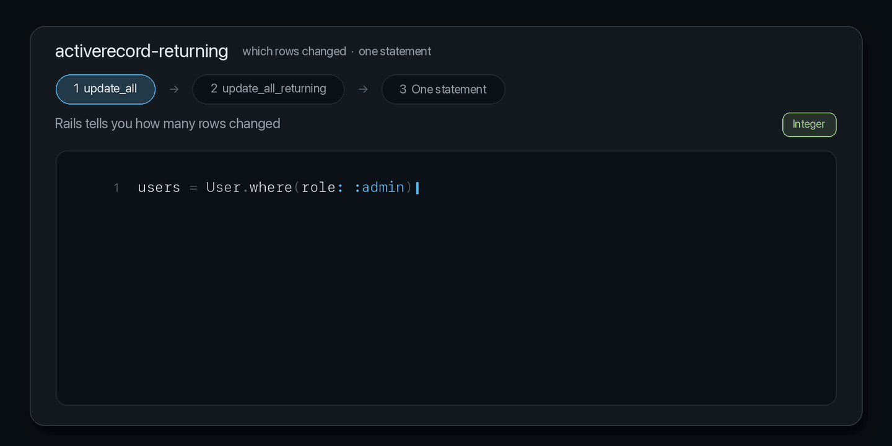

# activerecord-returning

[](https://rubygems.org/gems/activerecord-returning)
[](https://github.com/igorkasyanchuk/activerecord-returning/actions/workflows/ci.yml)

**`update_all` tells you how many rows changed. This gem tells you which ones.**



```ruby
User.where(role: :admin).update_all(role: :member)
# => 2                                    ...which two?

User.where(role: :admin).update_all_returning({ role: :member }, returning: %i[id email])
# => #<ActiveRecord::Result [[1, "ada@example.com"], [2, "grace@example.com"]]>
```

One statement. No `pluck` first, no `FOR UPDATE`, no window where another process can change the set
underneath you.

## TL;DR

```ruby
gem "activerecord-returning"
```

```ruby
# every form of update_all, plus returning:
User.where(role: :admin).update_all_returning(role: :member)                    # => primary keys
User.where(role: :admin).update_all_returning({ role: :member }, returning: :email)
User.where(role: :admin).update_all_returning({ role: :member }, returning: %i[id email])
User.where(role: :admin).update_all_returning({ role: :member }, returning: :_all)     # RETURNING *
User.update_all_returning(role: :member)                                        # on the model, too

Session.where(expires_at: ..1.week.ago).delete_all_returning(returning: :user_id)
```

Always returns an `ActiveRecord::Result`. PostgreSQL and SQLite 3.35+. Rails 7.0–8.1. Nothing is
overridden — `update_all` and `delete_all` behave exactly as before.

## Why

Every bulk change ends with the same question: *and then what?* Enqueue jobs for the rows you touched,
write an audit entry, send the mail, invalidate the cache. `update_all` hands back an Integer, so people
reach for one of these:

```ruby
# Racy. Another process can change the set between the two statements.
ids = Session.where(expires_at: ..1.week.ago).pluck(:id)
Session.where(id: ids).delete_all

# Correct, but three statements, a transaction and a lock you have to remember.
Session.transaction do
  ids = Session.where(expires_at: ..1.week.ago).lock.pluck(:id)
  Session.where(id: ids).delete_all
  ids
end
```

Databases have solved this for years with `RETURNING`. Rails exposes it on `insert_all`/`upsert_all` via a
`returning:` kwarg — but not on `update_all`/`delete_all`. Proposed upstream more than once, still not
merged as of Rails 8.1. This gem adds the two methods, using only public Active Record API.

## Examples

**Expire sessions, notify their owners**

```ruby
expired = Session.where(expires_at: ..Time.current).delete_all_returning(returning: :user_id)

expired.rows.flatten.uniq.each { |user_id| SessionExpiredMailer.notify(user_id).deliver_later }
```

**Claim work without a race**

```ruby
claimed = Job.pending.order(:created_at).limit(1)
             .update_all_returning({ status: :claimed, worker: worker_id }, returning: :_all)

job = Job.instantiate(claimed.to_a.first) if claimed.length.positive?
```

Two workers running that at once cannot claim the same row: the `UPDATE` picks it, and only one wins.

**Audit a bulk change**

```ruby
changed = Invoice.where(status: :draft).update_all_returning(
  { status: :issued, issued_at: Time.current },
  returning: %i[id number]
)

AuditLog.insert_all(changed.to_a.map { |row| { subject: "Invoice##{row["id"]}", action: "issued" } })
```

**Cancel and report in one pass**

```ruby
result = Subscription.where(trial_ends_at: ..Date.current)
                     .update_all_returning({ state: "expired" }, returning: %i[id user_id plan])

Rails.logger.info("expired #{result.length} trials: #{result.rows.inspect}")
```

**Get models back**

```ruby
users = User.where(role: :admin)
            .update_all_returning({ role: :member }, returning: :_all)
            .map { |attributes| User.instantiate(attributes) }

users.first.email        # => "ada@example.com"
users.first.new_record?  # => false
```

**Timestamps, if you want them** — like `update_all`, nothing is touched for you:

```ruby
User.where(role: :admin).update_all_returning(role: :member, updated_at: Time.current)
```

## `returning:`

| Value | Clause |
| --- | --- |
| omitted / `nil` | the primary key (all of them, for a composite primary key) |
| `:email` | `RETURNING "email"` |
| `%i[id email]` | `RETURNING "id", "email"` |
| `:_all` | `RETURNING *` |
| `Arel.sql("id, now() AS at")` | that SQL, verbatim |

Rejected on purpose, each with a message saying what to do instead: a bare `String` (pass symbols, or wrap
SQL in `Arel.sql`), an empty list, `returning: false` (use plain `update_all`), `:all` (renamed to `:_all`,
since `all` can be a real column name), and `:all`/`:_all` inside an array (`RETURNING *` cannot be combined
with other columns). A column literally named `all` or `_all` is still reachable with `Arel.sql`.

`updates` takes every shape `update_all` accepts:

```ruby
users.update_all_returning(role: :member)                     # Hash
users.update_all_returning("role = 0")                        # String
users.update_all_returning(["email = ?", "x@example.com"])    # Array
users.update_all_returning(role: :member, returning: :email)  # braceless — returning: is pulled out
```

Hash values go through the attribute's type, so enums, booleans, JSON and `alias_attribute` cast exactly as
`update_all` does.

## The return value

Always an `ActiveRecord::Result` — the same class `insert_all` returns, no wrapper, no subclass.

```ruby
result.columns  # => ["id", "email"]
result.rows     # => [[1, "ada@example.com"], [2, "grace@example.com"]]
result.to_a     # => [{"id" => 1, "email" => "ada@example.com"}, ...]
result.length   # => 2
result.each { |row| … }
```

Casting is the **adapter's**, not your model's: PostgreSQL types by OID and gives you a `Time` for a
`timestamp`; SQLite hands back the raw String. For model types:

```ruby
result.cast_values(Session.attribute_types)   # => [[7, 1, 2026-08-14 09:00:00 UTC], ...]
```

## Database support

| Database | Supported |
| --- | --- |
| PostgreSQL | yes |
| SQLite 3.35+ | yes |
| MySQL | no — raises `UnsupportedAdapter` |
| MariaDB | no — raises `UnsupportedAdapter` |

Read from `supports_update_returning?` where it exists, `supports_insert_returning?` otherwise. Two
deliberate exceptions:

- **MariaDB** answers `supports_insert_returning?` with `true` (it has `INSERT ... RETURNING` since 10.5)
  while having no `UPDATE ... RETURNING` at all — so the MySQL family is excluded explicitly, and CI runs a
  MariaDB lane to keep it that way.
- **Rails 7.0's SQLite3 adapter** predates those capability methods, so the SQLite version is checked
  directly.

MySQL has no `RETURNING` on any statement. There is nothing to generate, so it raises rather than guessing:

```ruby
User.where(role: :admin).update_all_returning(role: :member)
# ActiveRecord::Returning::UnsupportedAdapter:
#   the Trilogy adapter does not support RETURNING on UPDATE/DELETE
```

On MySQL, do it in two statements with a lock, inside a transaction:

```ruby
User.transaction do
  ids = User.where(role: :admin).lock.pluck(:id)
  User.where(id: ids).update_all(role: :member)
  User.where(id: ids)
end
```

The gem won't do that for you: it's only correct inside a transaction with a lock, and hiding that behind a
method that looks atomic hands a race to everyone who forgets.

## How it works

Your relation is reduced to a primary-key `SELECT` and used as a subquery:

```sql
UPDATE "users" SET "role" = 0, "lock_version" = COALESCE("lock_version", 0) + 1
WHERE "users"."id" IN (
  SELECT "users"."id" FROM "users" WHERE "users"."role" = 1 ORDER BY "users"."email" ASC LIMIT 2
)
RETURNING "id", "email"
```

Active Record builds that inner `SELECT`, so everything you already know keeps working:

```ruby
User.joins(:posts).where(posts: { published: true }).update_all_returning(role: :member)
User.order(:created_at).limit(100).update_all_returning({ role: :member }, returning: :id)
User.where(role: :admin).lock.update_all_returning(role: :member)   # FOR UPDATE in the subquery
user.posts.update_all_returning({ published: true }, returning: :id)
Memo.update_all_returning(title: "edited")                          # STI: this subclass only
Note.where(shop_id: 1).delete_all_returning   # WHERE ("shop_id", "note_id") IN (SELECT ...)
```

Default scopes, `merge`, `none`, `distinct` and composite primary keys are covered too. No
`Arel::UpdateManager`, no `_substitute_values`, no `build_arel` — nothing private, which is why one code
path spans Rails 7.0 to 8.1.

**Optimistic locking** works like `update_all`: the locking column is incremented unless you set it
yourself.

## Caveats

**Callbacks, validations and timestamps are skipped**, exactly as with `update_all`/`delete_all`. Nothing
is instantiated.

**Isolation.** The subquery runs inside the same statement, so there is no separate read. But under `READ
COMMITTED` (PostgreSQL's default) a row whose value changed after the statement's snapshot can still be
picked up. Where that matters, lock explicitly or raise the isolation level.

**Rejected relations**, each with a message pointing at the fix:

| | why |
| --- | --- |
| `includes` that eager-loads | a join can't be reduced to a primary-key subquery — use `joins` |
| `group` / `having` | the subquery would select an ungrouped column — use `where(id: grouped.select(:id))` |
| `from` | it renames the table the subquery reads, so the primary key would resolve to the row being changed and every row would match — use `unscope(:from)` |
| model without a primary key | nothing to match rows on |

**`delete_all_returning` on a `has_many` deletes.** `user.posts.delete_all` nullifies `posts.user_id`
unless the association declares `dependent: :delete_all`. `delete_all_returning` always issues a `DELETE`,
because returning rows that still exist would be a lie. Renaming one call to the other on an association
without `dependent: :delete_all` therefore removes rows where the old code only unset a foreign key.

**`returning: :_all` on a joined relation** returns the updated table's columns only — `RETURNING *` refers
to the updated row, not the join.

**Performance.** The subquery is always there, even for a plain `where`, while `update_all` writes a direct
`UPDATE ... WHERE` unless a join or limit forces otherwise. PostgreSQL usually turns it into a semi-join on
the same index; on a large hot-path table, `EXPLAIN` first.

## Active Record may grow its own

[rails/rails#57073](https://github.com/rails/rails/pull/57073) proposes an `update_all_returning` upstream.
Still open, and its API differs:

| | rails/rails#57073 | this gem |
| --- | --- | --- |
| columns | `select(...)` on the relation | `returning:` keyword |
| default | all columns | the primary key |

So the gemspec caps Active Record at `< 8.2`, and if `ActiveRecord::Relation` already defines either
method, the gem leaves that one alone and warns at boot instead of silently doing nothing.

Compared to `insert_all`/`upsert_all`, which already have `returning:`: same return type, same default.

The difference that matters is not the keyword — **`upsert_all` creates rows, these methods never do.**
It takes a list of attributes rather than a scope, so it cannot express `where(...)`, and any key that
isn't in the table yet becomes a new row:

```ruby
User.upsert_all([{ id: 999, email: "ghost@example.com" }], returning: %i[id email])
# => #<ActiveRecord::Result [[999, "ghost@example.com"]]>   looks like a row you changed
User.count # => 4                                           it was inserted
```

A stale id, a typo, a half-built payload — inserted, and handed back as though it had been updated.
`update_all_returning` can only touch rows the relation already matched.

Smaller differences: `:_all` is an addition here, `returning: false` raises instead of returning an empty
Result, and MySQL raises instead of quietly returning an empty Result.

## Why methods, not a chainable `.returning`

`User.returning(:id).where(...).update_all(...)` was considered and rejected:

1. `update_all` would return an Integer *or* a Result depending on state set somewhere else. The call site
   stops being readable.
2. It needs `prepend` over `update_all`. Removing the gem would then silently change working code instead
   of raising `NoMethodError` at the one place that used it.
3. Rails put `returning:` on `insert_all`/`upsert_all` as a keyword, not a query method.

The trade-off: you can't bake it into a scope. That's the intended cost.

## Errors

| Error | When |
| --- | --- |
| `ActiveRecord::Returning::UnsupportedAdapter` | MySQL, MariaDB, SQLite < 3.35 |
| `ActiveRecord::Returning::Error` | eager loading, `group`/`having`, `from`, no primary key |
| `ArgumentError` | empty updates, bare String / empty list / `false` in `returning:` |

`UnsupportedAdapter < Error < StandardError`.

## Requirements

Ruby 3.1+ · Active Record 7.0–8.1 · PostgreSQL or SQLite 3.35+

CI covers Ruby 3.1–3.4 × Rails 7.0, 7.1, 7.2, 8.0, 8.1 on SQLite, PostgreSQL on every one of those Rails
versions, and MySQL 8 and MariaDB 11 for the unsupported-adapter path.

## Development

```bash
bin/setup                 # create the dev database, load the schema, seed it
bin/console               # IRB with User, Post, Session, Note (composite PK), Memo (STI)
bundle exec rake test
```

All three take `DB=sqlite` (default), `DB=postgres`, `DB=mysql` or `DB=mariadb`; databases are created for
you, connections come from `PGHOST`/`PGUSER`/`PGPASSWORD` and `MYSQL_HOST`/`MYSQL_PORT`/`MYSQL_USER`/
`MYSQL_PASSWORD`.

```bash
bundle exec appraisal install && bundle exec appraisal rake test   # every supported Rails
python3 docs/render_demo.py                                        # re-render the demo GIF
```

### Releasing

```bash
# bump lib/activerecord/returning/version.rb, move CHANGELOG entries under the new version
bundle exec rake release
```

## Contributing

Bug reports and pull requests: https://github.com/igorkasyanchuk/activerecord-returning

## License

MIT. Copyright (c) 2026 Igor Kasyanchuk.
